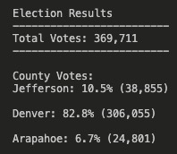
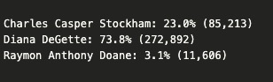

# **Election-Analysis**

## **1. Overview of Election Audit** 
The following analysis is focused on the audit of a recent local congressional election. We hace been given a csv dataset and we want to perform the following tasks:
1.  Calulate the number of total votes cast.
2.  Get a complete list of candidates who received votes.
3.  Calculate the total number of votes each candidate received.
4.  Calculate the percentage of votes each candidate won.
5.  Determine the winner of the election based on popular vote.

## **2. Election-Audit Results** 
* The analysis of the election shows that there were a total of 369,711 votes cast.

* The "image 1" holds the breakdown of the number of votes and the percentage of total votes for each county in the precint: 

 

     **Image 1**
                                               
* The county with the largest turnout was Denver with 306,055 votes, respectively.
* The image 2 holds the breakdown of the number of votes and the percentage of the total votes

 
 
             **Image 2**
* The winner of the election was Diana DeGette, who received 73.81% of the vote and 272,892 number of votes.

## **Election-Audit Summary**

This script has been created in order to perform an election audit in an efficient way  given a csv data file. However, some modifications might apply when used for another election. 
1. The original csv file provided had the county name as index [2} which might need to be adjusted when getting the candidate name from each row when working with another data set. 
2. Similarly, when extracting the county name, we loop though row 1 because in our case the index for county name is [1]. 

